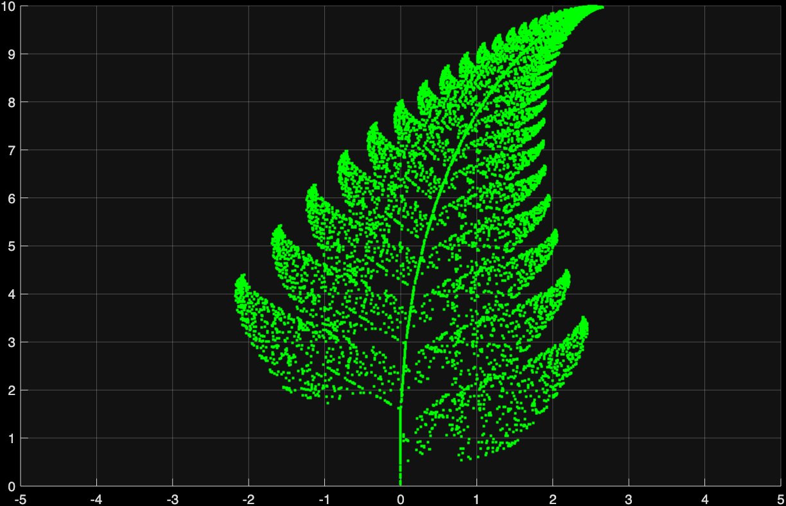
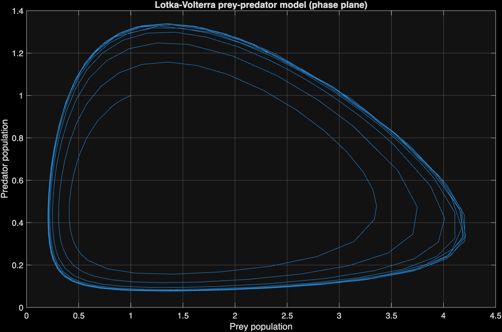
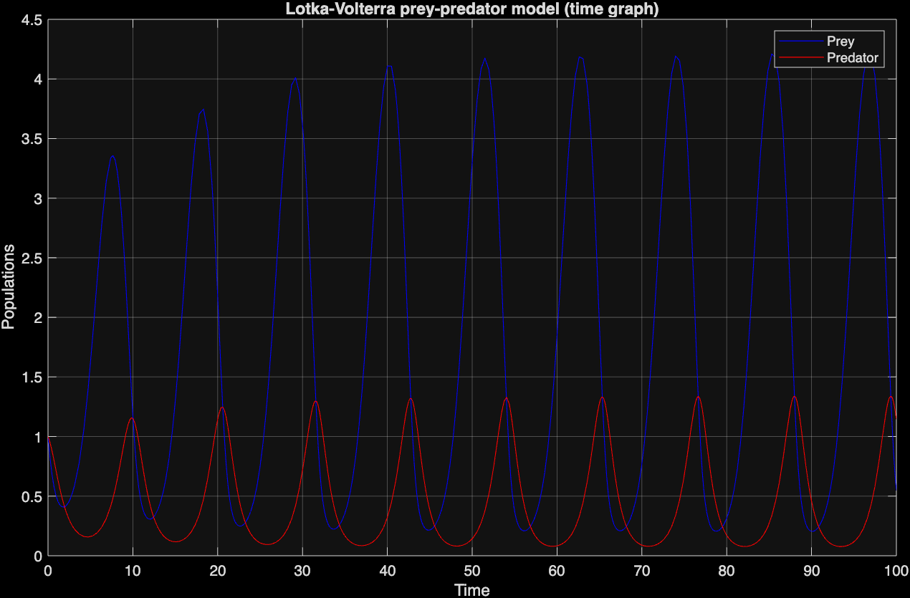
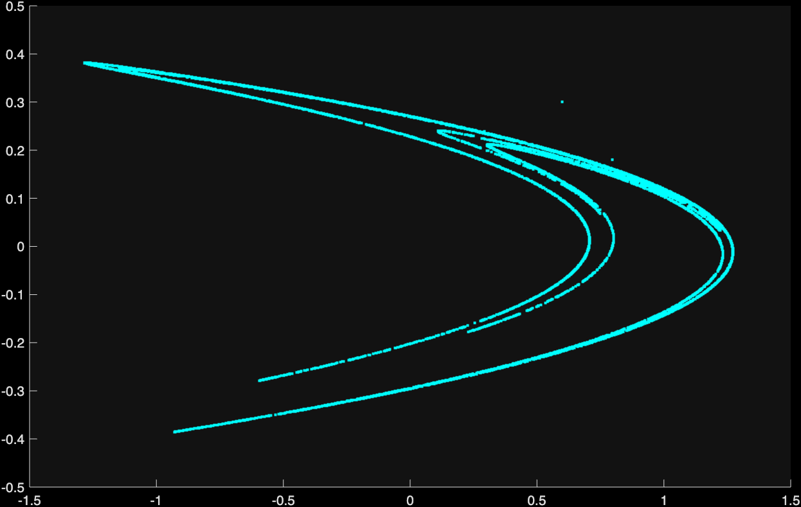
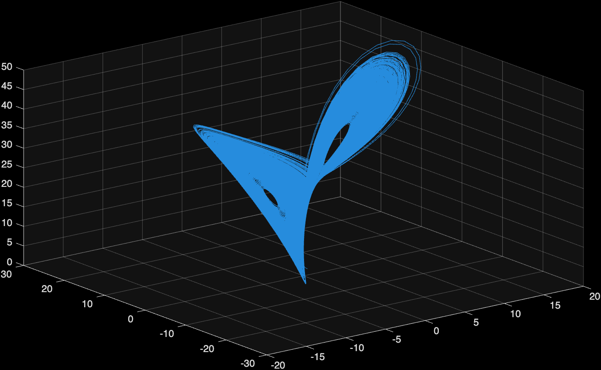
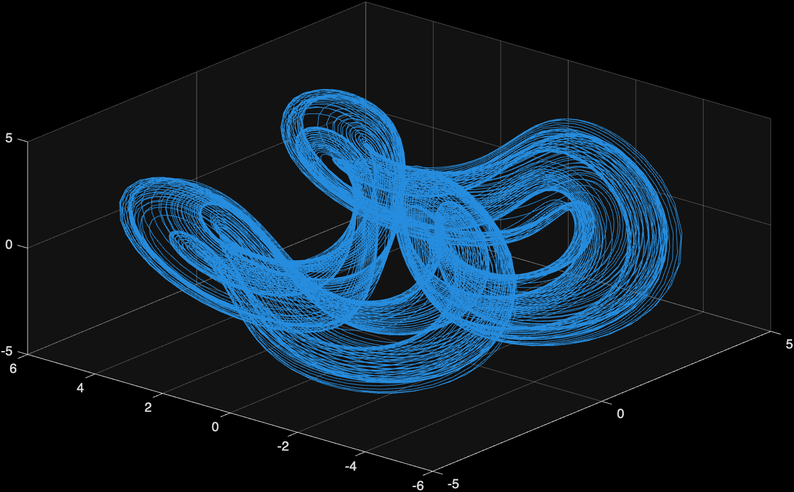
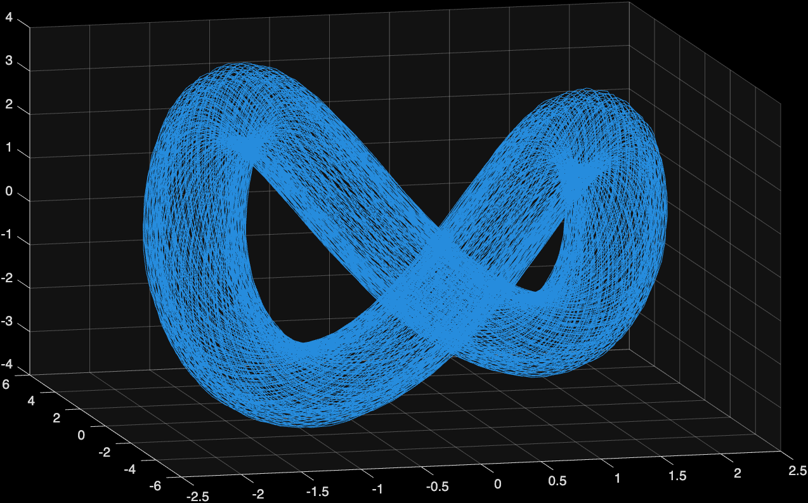
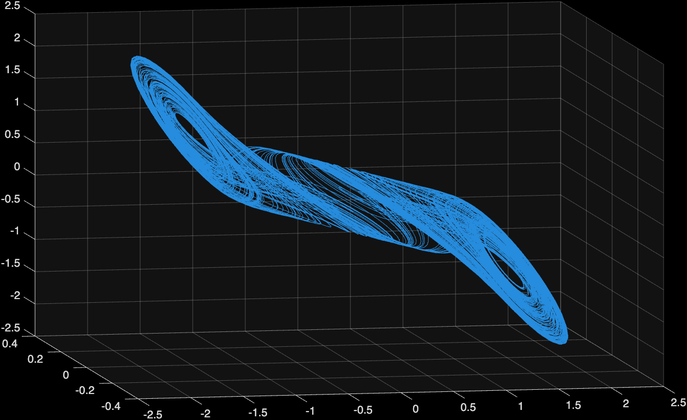

# Nonlinear dynamics

This is just a collection of some interesting models that I encountered in the course *Teoria dei Sistemi (Dinamica Nonlineare)* at Politecnico di Milano.

The scripts were made with MATLAB R2024b and you are free to run them and modify them to experiment with the various attractors they represent.

Below, some previews of the attractors which you can find in this repo.

## Barnsley Fern

## Lotka-Volterra prey-predator model

## Hénon attractor

## Lorenz attractor

## Nosé-Hoover attractor variants

### Initial conditions: $(2, 3, 1)$

### Initial conditions: $(0, 5, 0)$

## Chua attractor

> You can find the attribution for model, parameters and initial conditions for this attractor in the source code.
